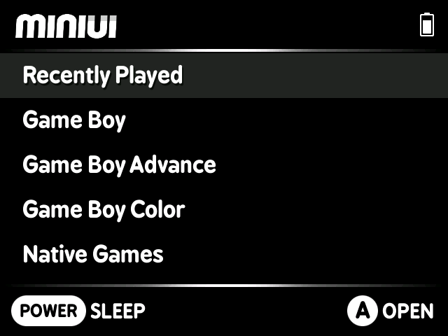
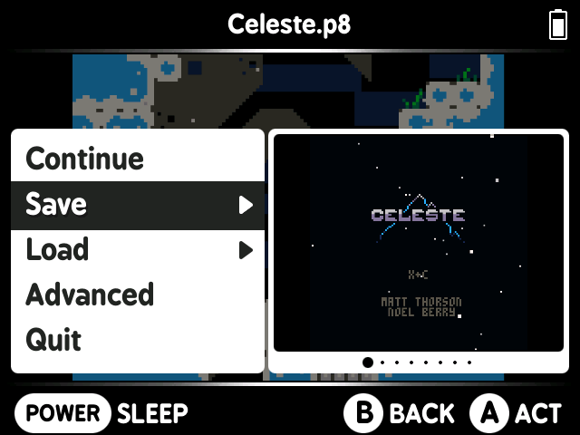

# MiniUI

_Fork of [MiniUI](https://github.com/shauninman/MiniUI) with a Black & White theme._

 

You can get a white bootlogo [here](https://github.com/axiel7/MiniUI-BW/blob/main/bits/bootlogos/miniui/image1.jpg?raw=true).

DISCLAIMER: I won't add any features nor fix issues, I don't know any C development.
I'll release a new version every time the official MiniUI gets updated.
